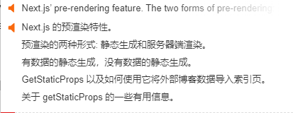

```
$ npm install --save clsx
```
一个很小的(234B)实用程序，用于有条件地构造 className 字符串。
也可以作为类名模块的更快更小的插件替代。





## 预渲染
在讲数据获取之前，我们先讲一下 Next.js 中最重要的概念之一：预渲染。

默认情况下，Next.js 预渲染每个页面。这意味着 Next.js提前为每个页面生成 HTML，而不是全部由客户端 JavaScript 完成。预渲染可以带来更好的性能和SEO。

每个生成的 HTML 都与该页面所需的最少 JavaScript 代码相关联。当浏览器加载页面时，其 JavaScript 代码就会运行并使页面完全交互。（这个过程称为水合作用。）


Next.js 有两种预渲染形式：静态生成和服务器端渲染。不同之处在于它何时生成页面的 HTML。

静态生成是在构建时生成 HTML 的预渲染方法。然后，预渲染的 HTML 会在每个请求中重复使用。
服务器端渲染是在每个请求上生成 HTML 的预渲染方法。